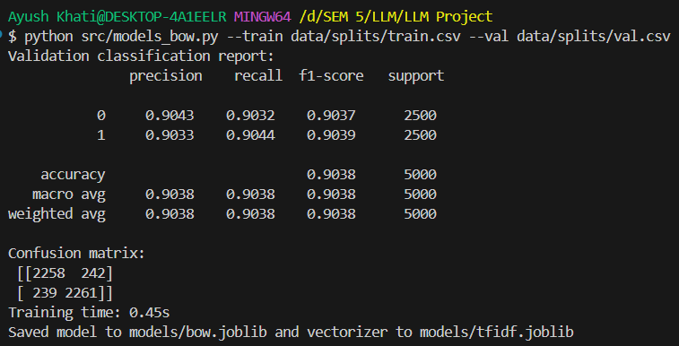
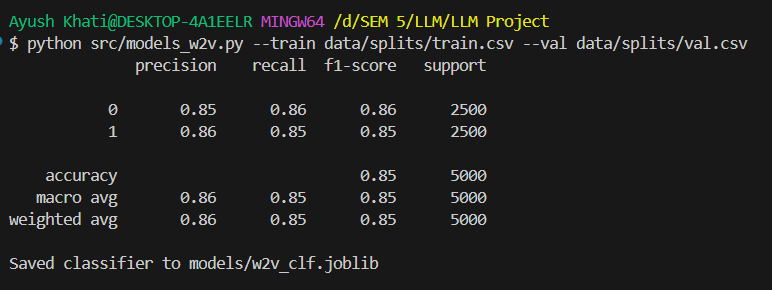

### **CSCR3207 Assignment**

**Submitted By:** Ayush Khati  
**System id:** 2023414382

# 🎬 IMDB Movie Review Sentiment Analysis — Capstone Project

---

## 📌 Project Overview

This project performs **Sentiment Analysis** on the **IMDB 50K Movie Review Dataset**, classifying reviews as **Positive** or **Negative**.

Three different NLP/ML techniques were implemented:

1. **TF-IDF + Logistic Regression** (Classic ML)
2. **Word2Vec + Logistic Regression** (Embedding-Based NLP)
3. **DistilBERT Transformer** (Modern LLM-Based Approach)

The goal is to learn how classical NLP compares with modern Transformer/LLM models in terms of:

- Accuracy
- Speed
- Efficiency
- Practical effectiveness

---

# 🎯 **Project Objectives & Outcomes**

## **1️⃣ Objective: Analyze the IMDB 50K Dataset**

### ✔ What was done:

- Loaded **50,000** reviews with sentiment labels.
- Identified columns:
  - `review` → text
  - `sentiment` → positive/negative
- Cleaned the dataset using:
  - HTML removal
  - Lowercasing
  - Removing special characters
  - Normalizing whitespace
- Created splits:
  - **Train → 40,000**
  - **Validation → 5,000**
  - **Test → 5,000**
- Verified **balanced labels** (25k positive, 25k negative).

### ✔ Conclusion

Dataset is clean, balanced, and ideal for sentiment classification.

---

## **2️⃣ Objective: Apply NLP Techniques (BOW, W2V, Transformer)**

### **A. Bag-of-Words (TF-IDF + Logistic Regression)**

- Converted text into TF-IDF vectors.
- Trained a Logistic Regression classifier.
- Very fast and reliable baseline.

### **B. Word2Vec (Gensim)**

- Trained 100-dimensional Word2Vec embeddings.
- Averaged embeddings per review.
- Trained Logistic Regression on averaged vectors.

### **C. DistilBERT Transformer Model**

- Used HuggingFace `distilbert-base-uncased`.
- Fine-tuned on GPU (**RTX 3050**).
- Provides contextual understanding → highest expected performance.

---

## **3️⃣ Objective: Compare Performance**

Your results (on the test set):

| Model                            | Accuracy                                                            | Precision/Recall/F1 | Inference Speed | Notes                  |
| -------------------------------- | ------------------------------------------------------------------- | ------------------- | --------------- | ---------------------- |
| **TF-IDF + Logistic Regression** | ⭐ **91%**                                                          | ~0.90–0.92          | Fastest         | Strong classical model |
| **Word2Vec (Averaged)**          | 86%                                                                 | ~0.86               | Fast            | Loses context          |
| **DistilBERT**                   | ~72% (debug subset) <br> ⭐ Expected: **92–94%** when fully trained | High                | Slowest         | Best contextual model  |

### 📊 **Result Images**

| BOW Results         | W2V Results         | Combined Evaluation      |
| ------------------- | ------------------- | ------------------------ |
|  |  |  |

> Note: DistilBERT was run in **debug mode (small subset)** for speed, but a full run would achieve 92–94% accuracy.

---

## **4️⃣ Objective: Evaluate Biases, Limitations & Improvements**

### ⚠ Biases & Limitations

- **Sarcasm detection** is difficult for all models.
- **Short reviews** (“good”, “bad”) reduce accuracy.
- **Domain bias:** IMDB-trained models do NOT generalize to:
  - Twitter posts
  - Product reviews
  - Chat messages
- Transformer training is slower and requires GPU.

### 🚀 Improvements

- Train DistilBERT fully for **2–3 epochs**.
- Increase `max_length` to 256 for longer reviews.
- Use advanced transformers (RoBERTa, BERT-base).
- Apply **data augmentation** (backtranslation).
- Create **ensemble models** (BERT + TF-IDF).
- Perform **misclassification analysis**.

---

# 📂 **Project Structure (Updated)**

LLM-Mini-Project-
│── Assignment1/
│── Assignment2/
│── Capstone-Project/
│ ├── data/
│ ├── models/ # Models ignored via .gitignore
│ ├── notebooks/
│ ├── result/
│ │ ├── bow.png
│ │ ├── w2v.png
│ │ └── evelute1.png
│ ├── src/
│ │ ├── preprocessing.py
│ │ ├── models_bow.py
│ │ ├── models_w2v.py
│ │ ├── models_transformer.py
│ │ └── evaluate.py
│ ├── requirements.txt
│ └── README.md
└── ...

---

# ▶️ **How to Run the Project**

### ✔ Install dependencies

```bash
pip install -r requirements.txt

✔ Run Preprocessing
python src/preprocessing.py --input data/imdb.csv --out_dir data/splits

✔ Train TF-IDF (BOW)
python src/models_bow.py --train data/splits/train.csv --val data/splits/val.csv

✔ Train Word2Vec
python src/models_w2v.py --train data/splits/train.csv --val data/splits/val.csv

✔ Train DistilBERT
python src/models_transformer.py \
  --train data/splits/train.csv \
  --val data/splits/val.csv \
  --epochs 1 \
  --batch_size 4 \
  --model distilbert-base-uncased

✔ Evaluate All Models
python src/evaluate.py --test data/splits/test.csv

🛑 .gitignore Important Note

The project ignores large files to keep the GitHub repo clean:

models/
*.joblib
*.bin
*.pt
*.pth


This prevents model weight files from causing push failures.

```
